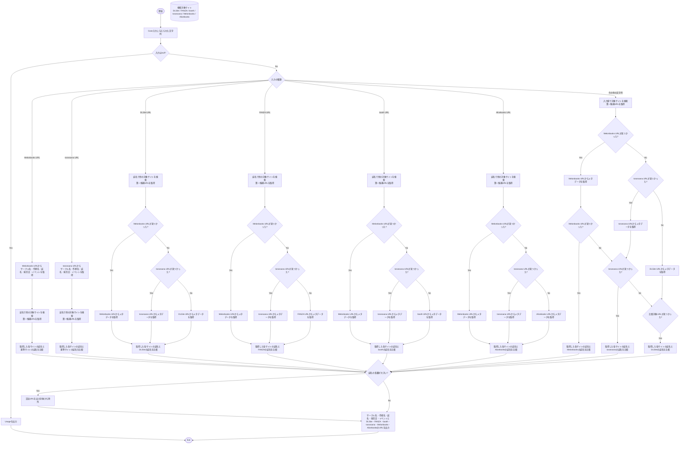

# searchDojin
同人誌名またはとらメロンのURLをもとに、サークル名・作者名・誌名・発行イベント・発行日と、DLSite/FANZA/Booth/とら/メロンの販売URLを拾ってこようとする

# 使い方
[python](https://www.python.org/downloads/)をインストールして、

```shell
py -m pip requests
py -m pip bs4
```
で必要なライブラリを放り込んだら、
入力ファイルに誌名か、とらorメロンのURLを1行1冊入力して、
pyファイル全部並べたフォルダからコマンドプロンプトで
python3 search.py (入力ファイル) > (出力ファイル)
ってする。

これが


こうして


こうなる


# 全体の流れ



# 制約とか

DLSite/Fanza/Boothだと発行イベントうまく取れなかったり作者名拾えなかったりするからとらメロンを最優先にしてる。

# ToDoとか

GithubCopilot君に作らせただけなので多分バグとかいっぱいあるから見つけたら直したい。

僕が最終的にGoogleSpreadsheetで蔵書管理してるから張り付けやすいようにタブ区切りテキストを吐き出してるけど、jsonとかにした方が扱いやすくなったりするのかな？

でも検索精度がいまいちだからなあ。
やってること自体は各サイトで誌名で検索して最初の作品を拾うだけなので、まあまあの高確率で関係ない作品のURLを拾ってくる。特にBooth。
精度上げたいけどあんまり難しいことはできそうにないのでとりあえずこのまま使って手動チェックしてるけどめんどくさいからもう少しなんとかしたいね。

本当はGoogleSpreadsheetの情報を月イチとかでクロールして拾い直したりできるといいよね。たまに半年後に急にDLSiteで頒布開始とかもあるし。もっと言えばDLSiteはお気に入り登録してお気に入りフォルダ「購入済み」に移したい。どうしても手動でやってる。大変。
